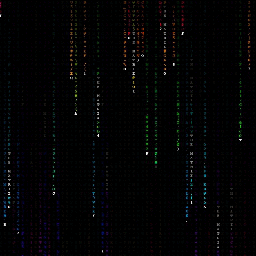
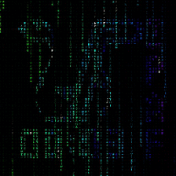
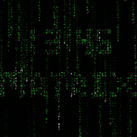
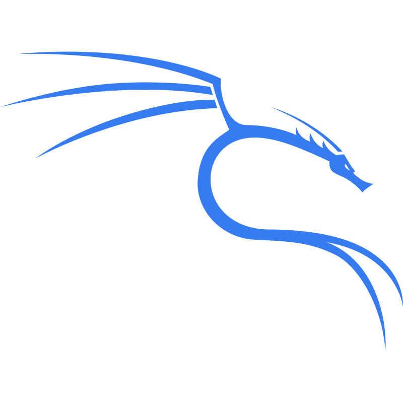
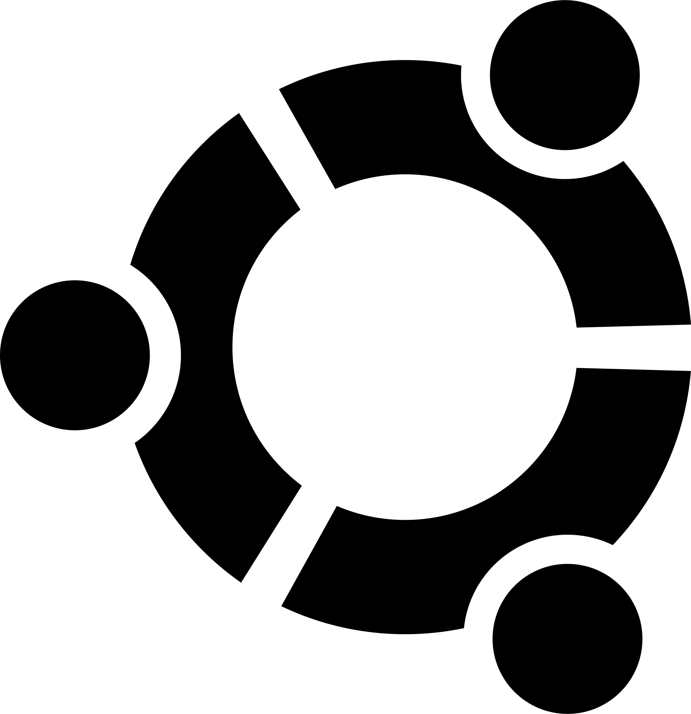
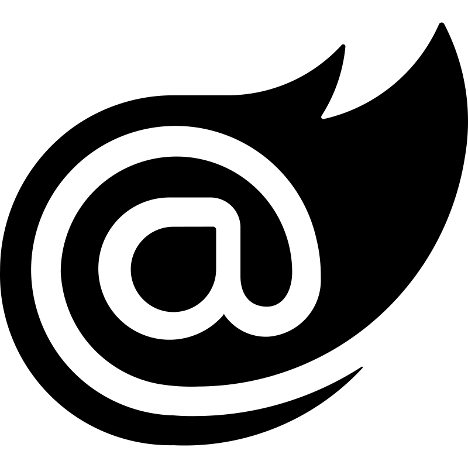

   
   
   
   
   <!---->

# [WE] NeoMatrix (The Red 💊)

This is a highly customizable animated Matrix wallpaper for Wallpaper Engine (Web Browser Compatible)

## Preview [(Web Demo)](https://ipdotsetaf.github.io/NeoMatrix/)

   
   
   

   
   
   

##

   

   

##

## Features
- Rain Customization
   - Matrix Speed
   - Trail Length
   - Drop Count/Column (1-5)
   - Initial Fall Animation
      - None
      - Fall
      - Scatter
- Color Customization
   - Color Mode
      - Static Color
      - RGB Cycle
      - Vertical Rainbow
      - Horizontal Rainbow
   - Animation Speed (Rainbow and RGB Cycle)
   - First Character HighLighting 
- Characters Customization
   - Char set
      - 6 Presets
      - Original Matrix Characters
      - CUSTOM
- Font Customization
   - Size
   - Font
      - 3 Presets
      - CUSTOM
- Audio Customization (inspired by [Colorful Matrix](https://steamcommunity.com/sharedfiles/filedetails/?id=1103493745))
   - Audio Response
   - Sensetivity
   - Silence Animation
   - Silence Timeout
- Logo Customization
   - Logo
      - None
      - 23 presets :

         

            
            
            
            
            
            
            
            
            
            
            
            
            
            
            
            
            
            
            
            
            
            
            
         

      - CUSTOM
   - Preserve Logo Color
   - Scale
   - Position
- Clock
   - Clock
      - None
      - Horizontal
      - Vertical
   - 12/24 Hour Format
   - Day-light Saving
   - Scale
   - Position
- Message
   - Message
      - None
      - Horizontal
   - Text
   - Scale
   - Position
- Other Customizations
   - Codes (these will be shown as decrypted Messages)

### ✔️ Web Browser Compatible
   - Preset save/load

## Are you ready to be free?

1. Install `Wallpaper Engine`
2. Goto the Install folder: `Wallpaper Engine\projects\myprojects`
3. Download this Repository:
   - `git clone https://github.com/IPdotSetAF/NeoMatrix`
   or
   - Download this Repo as ZIP and extract it.

## TODO:
- Small Clock and Messsage
- Random Character Mutations
- Random Character Flip
- Random drop length (not to the bottom of the screen)
- [Lively](https://github.com/rocksdanister/lively) Compatible version
- Mobile support

## Contribution
- You can open Issues for any bug report or feature request.
- You are free to contribute to this project by following these steps:
   1. Fork this Repo.
   2. Create a new branch for your feature/bugfix in your forked Repo.
   3. Commit your changes to the new branch you just made.
   4. Create a pull request from your branch into the `master` branch of This Repo([https://github.com/IPdotSetAF/NeoMatrix](https://github.com/IPdotSetAF/NeoMatrix)).
