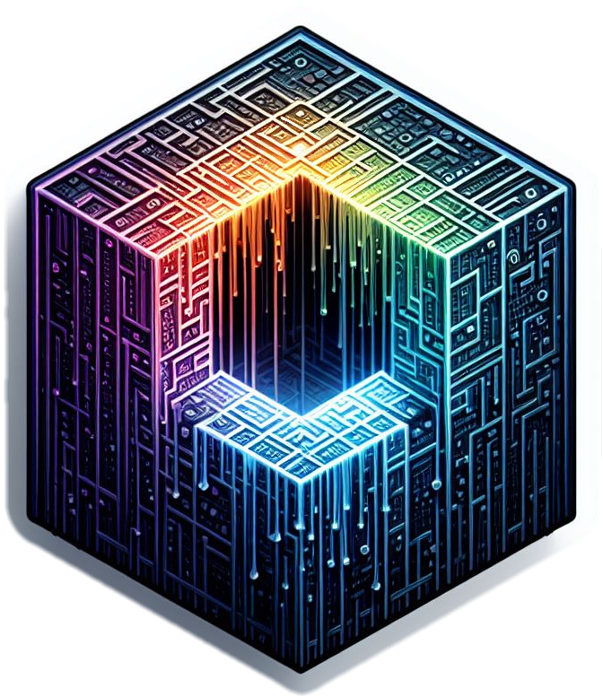

   

   
   
   
   
   <!---->

# NeoMatrix (The Red 💊)

This is a highly customizable animated Matrix wallpaper for Wallpaper Engine (Web Browser Compatible)

## Preview [(Web Demo)](https://ipdotsetaf.github.io/NeoMatrix/)

Click on each preview to watch live

   <a href="https://ipdotsetaf.github.io/NeoMatrix/?preset=eyJjb250cm9sbGVycyI6e30sImZvbGRlcnMiOnsiUmFpbiI6eyJjb250cm9sbGVycyI6eyJNYXRyaXggU3BlZWQiOjI0LCJUcmFpbCBMZW5ndGgiOjAuODYsIkRyb3AgQ291bnQvQ29sdW1uIjoxLCJJbml0aWFsIEFuaW1hdGlvbiI6IjEifSwiZm9sZGVycyI6e319LCJDb2xvciI6eyJjb250cm9sbGVycyI6eyJDb2xvciBNb2RlIjoiMCIsIk1hdHJpeCBDb2xvciI6IiMwMGIzZmYiLCJDb2xvciBBbmltYXRpb24gU3BlZWQiOjAuNSwiSGlnaGxpZ2h0IEZpcnN0IENoYXJhY3RlciI6dHJ1ZX0sImZvbGRlcnMiOnt9fSwiQ2hhcmFjdGVycyI6eyJjb250cm9sbGVycyI6eyJDaGFyIHNldCI6IjQiLCJDdXN0b20gQ2hhciBTZXQiOiIwMTIzNDU2Nzg5QUJDREVGIn0sImZvbGRlcnMiOnt9fSwiRm9udCI6eyJjb250cm9sbGVycyI6eyJGb250IFNpemUiOjE1LCJGb250IjoiMSIsIkN1c3RvbSBGb250IjoibW9ub3NwYWNlIn0sImZvbGRlcnMiOnt9fSwiQXVkaW8gKG5vdCBhdmFpbGFibGUgaW4gd2ViIHZlcnNpb24pIjp7ImNvbnRyb2xsZXJzIjp7fSwiZm9sZGVycyI6e319LCJMb2dvIjp7ImNvbnRyb2xsZXJzIjp7IkxvZ28iOiIzIiwiQ3VzdG9tIExvZ28gVVJMIChTVkcvUE5HKSI6IiIsIlByZXNlcnZlIExvZ28gQ29sb3IiOmZhbHNlLCJTY2FsZSI6MS4yfSwiZm9sZGVycyI6eyJQb3NpdGlvbiI6eyJjb250cm9sbGVycyI6eyJYIjowLCJZIjowfSwiZm9sZGVycyI6e319fX0sIkNsb2NrIjp7ImNvbnRyb2xsZXJzIjp7IkNsb2NrIjoiMCIsIjI0IEhvdXIgZm9ybWF0Ijp0cnVlLCJEYXktbGlnaHQgU2F2aW5nIjowLCJTY2FsZSI6MX0sImZvbGRlcnMiOnsiUG9zaXRpb24iOnsiY29udHJvbGxlcnMiOnsiWCI6MCwiWSI6MH0sImZvbGRlcnMiOnt9fX19LCJNZXNzYWdlIjp7ImNvbnRyb2xsZXJzIjp7Ik1lc3NhZ2UiOmZhbHNlLCJNZXNzYWdlIFRleHQiOiJUSEUgTUFUUklYIiwiU2NhbGUiOjF9LCJmb2xkZXJzIjp7IlBvc2l0aW9uIjp7ImNvbnRyb2xsZXJzIjp7IlgiOjAsIlkiOjB9LCJmb2xkZXJzIjp7fX19fSwiT3RoZXIiOnsiY29udHJvbGxlcnMiOnsiQ29kZXMgKENvbW1hIHNlcGFyYXRlZCkiOiJUSEUgTUFUUklYLEtBTEksSVAuQUYifSwiZm9sZGVycyI6e319fX0%3D"></a>
   <a href="https://ipdotsetaf.github.io/NeoMatrix/?preset=eyJjb250cm9sbGVycyI6e30sImZvbGRlcnMiOnsiUmFpbiI6eyJjb250cm9sbGVycyI6eyJNYXRyaXggU3BlZWQiOjI0LCJUcmFpbCBMZW5ndGgiOjAuODYsIkRyb3AgQ291bnQvQ29sdW1uIjoxLCJJbml0aWFsIEFuaW1hdGlvbiI6IjEifSwiZm9sZGVycyI6e319LCJDb2xvciI6eyJjb250cm9sbGVycyI6eyJDb2xvciBNb2RlIjoiMCIsIk1hdHJpeCBDb2xvciI6IiMwMGZmMDAiLCJDb2xvciBBbmltYXRpb24gU3BlZWQiOjAuNSwiSGlnaGxpZ2h0IEZpcnN0IENoYXJhY3RlciI6dHJ1ZX0sImZvbGRlcnMiOnt9fSwiQ2hhcmFjdGVycyI6eyJjb250cm9sbGVycyI6eyJDaGFyIHNldCI6IjQiLCJDdXN0b20gQ2hhciBTZXQiOiIwMTIzNDU2Nzg5QUJDREVGIn0sImZvbGRlcnMiOnt9fSwiRm9udCI6eyJjb250cm9sbGVycyI6eyJGb250IFNpemUiOjE3LCJGb250IjoiMSIsIkN1c3RvbSBGb250IjoibW9ub3NwYWNlIn0sImZvbGRlcnMiOnt9fSwiQXVkaW8gKG5vdCBhdmFpbGFibGUgaW4gd2ViIHZlcnNpb24pIjp7ImNvbnRyb2xsZXJzIjp7fSwiZm9sZGVycyI6e319LCJMb2dvIjp7ImNvbnRyb2xsZXJzIjp7IkxvZ28iOiIwIiwiQ3VzdG9tIExvZ28gVVJMIChTVkcvUE5HKSI6IiIsIlByZXNlcnZlIExvZ28gQ29sb3IiOmZhbHNlLCJTY2FsZSI6MX0sImZvbGRlcnMiOnsiUG9zaXRpb24iOnsiY29udHJvbGxlcnMiOnsiWCI6MCwiWSI6MH0sImZvbGRlcnMiOnt9fX19LCJDbG9jayI6eyJjb250cm9sbGVycyI6eyJDbG9jayI6IjAiLCIyNCBIb3VyIGZvcm1hdCI6dHJ1ZSwiRGF5LWxpZ2h0IFNhdmluZyI6MCwiU2NhbGUiOjF9LCJmb2xkZXJzIjp7IlBvc2l0aW9uIjp7ImNvbnRyb2xsZXJzIjp7IlgiOjAsIlkiOjB9LCJmb2xkZXJzIjp7fX19fSwiTWVzc2FnZSI6eyJjb250cm9sbGVycyI6eyJNZXNzYWdlIjpmYWxzZSwiTWVzc2FnZSBUZXh0IjoiVEhFIE1BVFJJWCIsIlNjYWxlIjoxfSwiZm9sZGVycyI6eyJQb3NpdGlvbiI6eyJjb250cm9sbGVycyI6eyJYIjowLCJZIjowfSwiZm9sZGVycyI6e319fX0sIk90aGVyIjp7ImNvbnRyb2xsZXJzIjp7IkNvZGVzIChDb21tYSBzZXBhcmF0ZWQpIjoiVEhFIE1BVFJJWCJ9LCJmb2xkZXJzIjp7fX19fQ%3D%3D"></a>
   <a href="https://ipdotsetaf.github.io/NeoMatrix/?preset=eyJjb250cm9sbGVycyI6e30sImZvbGRlcnMiOnsiUmFpbiI6eyJjb250cm9sbGVycyI6eyJNYXRyaXggU3BlZWQiOjI0LCJUcmFpbCBMZW5ndGgiOjAuODYsIkRyb3AgQ291bnQvQ29sdW1uIjoxLCJJbml0aWFsIEFuaW1hdGlvbiI6IjEifSwiZm9sZGVycyI6e319LCJDb2xvciI6eyJjb250cm9sbGVycyI6eyJDb2xvciBNb2RlIjoiMCIsIk1hdHJpeCBDb2xvciI6IiMwMGZmMDAiLCJDb2xvciBBbmltYXRpb24gU3BlZWQiOjAuNSwiSGlnaGxpZ2h0IEZpcnN0IENoYXJhY3RlciI6dHJ1ZX0sImZvbGRlcnMiOnt9fSwiQ2hhcmFjdGVycyI6eyJjb250cm9sbGVycyI6eyJDaGFyIHNldCI6IjMiLCJDdXN0b20gQ2hhciBTZXQiOiIwMTIzNDU2Nzg5QUJDREVGIn0sImZvbGRlcnMiOnt9fSwiRm9udCI6eyJjb250cm9sbGVycyI6eyJGb250IFNpemUiOjE1LCJGb250IjoiMyIsIkN1c3RvbSBGb250IjoibW9ub3NwYWNlIn0sImZvbGRlcnMiOnt9fSwiQXVkaW8gKG5vdCBhdmFpbGFibGUgaW4gd2ViIHZlcnNpb24pIjp7ImNvbnRyb2xsZXJzIjp7fSwiZm9sZGVycyI6e319LCJMb2dvIjp7ImNvbnRyb2xsZXJzIjp7IkxvZ28iOiI4IiwiQ3VzdG9tIExvZ28gVVJMIChTVkcvUE5HKSI6IiIsIlByZXNlcnZlIExvZ28gQ29sb3IiOnRydWUsIlNjYWxlIjowLjh9LCJmb2xkZXJzIjp7IlBvc2l0aW9uIjp7ImNvbnRyb2xsZXJzIjp7IlgiOjAsIlkiOi0xMjV9LCJmb2xkZXJzIjp7fX19fSwiQ2xvY2siOnsiY29udHJvbGxlcnMiOnsiQ2xvY2siOiIxIiwiMjQgSG91ciBmb3JtYXQiOnRydWUsIkRheS1saWdodCBTYXZpbmciOjAsIlNjYWxlIjoyfSwiZm9sZGVycyI6eyJQb3NpdGlvbiI6eyJjb250cm9sbGVycyI6eyJYIjowLCJZIjoxNH0sImZvbGRlcnMiOnt9fX19LCJNZXNzYWdlIjp7ImNvbnRyb2xsZXJzIjp7Ik1lc3NhZ2UiOmZhbHNlLCJNZXNzYWdlIFRleHQiOiJUSEUgTUFUUklYIiwiU2NhbGUiOjF9LCJmb2xkZXJzIjp7IlBvc2l0aW9uIjp7ImNvbnRyb2xsZXJzIjp7IlgiOjAsIlkiOjB9LCJmb2xkZXJzIjp7fX19fSwiT3RoZXIiOnsiY29udHJvbGxlcnMiOnsiQ29kZXMgKENvbW1hIHNlcGFyYXRlZCkiOiJUSEUgTUFUUklYLElQLkFGIn0sImZvbGRlcnMiOnt9fX19"></a>

   <a href="https://ipdotsetaf.github.io/NeoMatrix/?preset=eyJjb250cm9sbGVycyI6e30sImZvbGRlcnMiOnsiUmFpbiI6eyJjb250cm9sbGVycyI6eyJNYXRyaXggU3BlZWQiOjI0LCJUcmFpbCBMZW5ndGgiOjAuODIsIkRyb3AgQ291bnQvQ29sdW1uIjoxLCJJbml0aWFsIEFuaW1hdGlvbiI6IjEifSwiZm9sZGVycyI6e319LCJDb2xvciI6eyJjb250cm9sbGVycyI6eyJDb2xvciBNb2RlIjoiMyIsIk1hdHJpeCBDb2xvciI6IiMwMGZmMDAiLCJDb2xvciBBbmltYXRpb24gU3BlZWQiOjAuMTQsIkhpZ2hsaWdodCBGaXJzdCBDaGFyYWN0ZXIiOmZhbHNlfSwiZm9sZGVycyI6e319LCJDaGFyYWN0ZXJzIjp7ImNvbnRyb2xsZXJzIjp7IkNoYXIgc2V0IjoiMyIsIkN1c3RvbSBDaGFyIFNldCI6IjAxMjM0NTY3ODlBQkNERUYifSwiZm9sZGVycyI6e319LCJGb250Ijp7ImNvbnRyb2xsZXJzIjp7IkZvbnQgU2l6ZSI6MTUsIkZvbnQiOiIzIiwiQ3VzdG9tIEZvbnQiOiJtb25vc3BhY2UifSwiZm9sZGVycyI6e319LCJBdWRpbyAobm90IGF2YWlsYWJsZSBpbiB3ZWIgdmVyc2lvbikiOnsiY29udHJvbGxlcnMiOnt9LCJmb2xkZXJzIjp7fX0sIkxvZ28iOnsiY29udHJvbGxlcnMiOnsiTG9nbyI6IjIiLCJDdXN0b20gTG9nbyBVUkwgKFNWRy9QTkcpIjoiIiwiUHJlc2VydmUgTG9nbyBDb2xvciI6ZmFsc2UsIlNjYWxlIjowLjl9LCJmb2xkZXJzIjp7IlBvc2l0aW9uIjp7ImNvbnRyb2xsZXJzIjp7IlgiOi03MCwiWSI6LTg3fSwiZm9sZGVycyI6e319fX0sIkNsb2NrIjp7ImNvbnRyb2xsZXJzIjp7IkNsb2NrIjoiMSIsIjI0IEhvdXIgZm9ybWF0Ijp0cnVlLCJEYXktbGlnaHQgU2F2aW5nIjowLCJTY2FsZSI6Mn0sImZvbGRlcnMiOnsiUG9zaXRpb24iOnsiY29udHJvbGxlcnMiOnsiWCI6LTUsIlkiOjE4fSwiZm9sZGVycyI6e319fX0sIkRheSI6eyJjb250cm9sbGVycyI6eyJEYXkiOiIyIiwiQWxsIENBUFMiOnRydWUsIlZlcnRpY2FsIE9yaWVudGF0aW9uIjpmYWxzZSwiU2NhbGUiOjB9LCJmb2xkZXJzIjp7IlBvc2l0aW9uIjp7ImNvbnRyb2xsZXJzIjp7IlgiOjYsIlkiOjI1fSwiZm9sZGVycyI6e319fX0sIkRhdGUiOnsiY29udHJvbGxlcnMiOnsiRGF0ZSI6IjEiLCJZZWFyIjoiMSIsIk9yZGVyIjoiMCIsIk1vbnRoIE5hbWUiOnRydWUsIkFsbCBDQVBTIjp0cnVlLCJEZWxpbWl0ZXIiOiIyIiwiVmVydGljYWwgT3JpZW50YXRpb24iOmZhbHNlLCJTY2FsZSI6MH0sImZvbGRlcnMiOnsiUG9zaXRpb24iOnsiY29udHJvbGxlcnMiOnsiWCI6LTIsIlkiOjI1fSwiZm9sZGVycyI6e319fX0sIk1lc3NhZ2UiOnsiY29udHJvbGxlcnMiOnsiTWVzc2FnZSI6dHJ1ZSwiTWVzc2FnZSBUZXh0IjoiSVxcblBcXG5BXFxuRiIsIlNjYWxlIjoyfSwiZm9sZGVycyI6eyJQb3NpdGlvbiI6eyJjb250cm9sbGVycyI6eyJYIjoyMiwiWSI6MH0sImZvbGRlcnMiOnt9fX19LCJPdGhlciI6eyJjb250cm9sbGVycyI6eyJDb2RlcyAoQ29tbWEgc2VwYXJhdGVkKSI6IklQLkFGLFRIRSBNQVRSSVgifSwiZm9sZGVycyI6e319fX0%3D"></a>
   <a href="https://ipdotsetaf.github.io/NeoMatrix/?preset=eyJjb250cm9sbGVycyI6e30sImZvbGRlcnMiOnsiUmFpbiI6eyJjb250cm9sbGVycyI6eyJNYXRyaXggU3BlZWQiOjIwLCJUcmFpbCBMZW5ndGgiOjAuNzUsIkRyb3AgQ291bnQvQ29sdW1uIjoyLCJJbml0aWFsIEFuaW1hdGlvbiI6IjIifSwiZm9sZGVycyI6e319LCJDb2xvciI6eyJjb250cm9sbGVycyI6eyJDb2xvciBNb2RlIjoiMyIsIk1hdHJpeCBDb2xvciI6IiMwMGZmMDAiLCJDb2xvciBBbmltYXRpb24gU3BlZWQiOjAuMTIsIkhpZ2hsaWdodCBGaXJzdCBDaGFyYWN0ZXIiOmZhbHNlfSwiZm9sZGVycyI6e319LCJDaGFyYWN0ZXJzIjp7ImNvbnRyb2xsZXJzIjp7IkNoYXIgc2V0IjoiMyIsIkN1c3RvbSBDaGFyIFNldCI6IjAxMjM0NTY3ODlBQkNERUYifSwiZm9sZGVycyI6e319LCJGb250Ijp7ImNvbnRyb2xsZXJzIjp7IkZvbnQgU2l6ZSI6MTQsIkZvbnQiOiIzIiwiQ3VzdG9tIEZvbnQiOiJtb25vc3BhY2UifSwiZm9sZGVycyI6e319LCJBdWRpbyAobm90IGF2YWlsYWJsZSBpbiB3ZWIgdmVyc2lvbikiOnsiY29udHJvbGxlcnMiOnt9LCJmb2xkZXJzIjp7fX0sIkxvZ28iOnsiY29udHJvbGxlcnMiOnsiTG9nbyI6IjAiLCJDdXN0b20gTG9nbyBVUkwgKFNWRy9QTkcpIjoiIiwiUHJlc2VydmUgTG9nbyBDb2xvciI6ZmFsc2UsIlNjYWxlIjoxfSwiZm9sZGVycyI6eyJQb3NpdGlvbiI6eyJjb250cm9sbGVycyI6eyJYIjowLCJZIjowfSwiZm9sZGVycyI6e319fX0sIkNsb2NrIjp7ImNvbnRyb2xsZXJzIjp7IkNsb2NrIjoiMSIsIjI0IEhvdXIgZm9ybWF0Ijp0cnVlLCJEYXktbGlnaHQgU2F2aW5nIjowLCJTY2FsZSI6MH0sImZvbGRlcnMiOnsiUG9zaXRpb24iOnsiY29udHJvbGxlcnMiOnsiWCI6MCwiWSI6Mn0sImZvbGRlcnMiOnt9fX19LCJEYXkiOnsiY29udHJvbGxlcnMiOnsiRGF5IjoiMiIsIkFsbCBDQVBTIjpmYWxzZSwiVmVydGljYWwgT3JpZW50YXRpb24iOmZhbHNlLCJTY2FsZSI6MH0sImZvbGRlcnMiOnsiUG9zaXRpb24iOnsiY29udHJvbGxlcnMiOnsiWCI6MCwiWSI6NH0sImZvbGRlcnMiOnt9fX19LCJEYXRlIjp7ImNvbnRyb2xsZXJzIjp7IkRhdGUiOiIxIiwiWWVhciI6IjIiLCJPcmRlciI6IjAiLCJNb250aCBOYW1lIjpmYWxzZSwiQWxsIENBUFMiOmZhbHNlLCJEZWxpbWl0ZXIiOiI0IiwiVmVydGljYWwgT3JpZW50YXRpb24iOmZhbHNlLCJTY2FsZSI6MH0sImZvbGRlcnMiOnsiUG9zaXRpb24iOnsiY29udHJvbGxlcnMiOnsiWCI6MCwiWSI6Mn0sImZvbGRlcnMiOnt9fX19LCJNZXNzYWdlIjp7ImNvbnRyb2xsZXJzIjp7Ik1lc3NhZ2UiOnRydWUsIk1lc3NhZ2UgVGV4dCI6IklQLkFGIFByZXNlbnRzXFxuICBORU8gTUFUUklYIiwiU2NhbGUiOjB9LCJmb2xkZXJzIjp7IlBvc2l0aW9uIjp7ImNvbnRyb2xsZXJzIjp7IlgiOjAsIlkiOi0xfSwiZm9sZGVycyI6e319fX0sIk90aGVyIjp7ImNvbnRyb2xsZXJzIjp7IkNvZGVzIChDb21tYSBzZXBhcmF0ZWQpIjoiIn0sImZvbGRlcnMiOnt9fX19"></a>

##

   

   

##

## Compatibility
- ✔️ Wallpaper Engine
- ✔️ Sucrose Wallpaper Engine
- ✔️ WEB Browser

## Features
- Rain Customization
   - Matrix Speed
   - Trail Length
   - Drop Count/Column (1-5)
   - Initial Fall Animation
      - Fall
      - Scatter
- Color Customization
   - Color Mode
      - Static Color
      - RGB Cycle
      - Vertical Rainbow
      - Horizontal Rainbow
   - Animation Speed (Rainbow and RGB Cycle)
   - First Character HighLighting 
- Characters Customization
   - Char set
      - 6 Presets
      - Original Matrix Characters
      - CUSTOM
- Font Customization
   - Size
   - Font
      - 3 Presets
      - CUSTOM
- Audio Customization (inspired by [Colorful Matrix](https://steamcommunity.com/sharedfiles/filedetails/?id=1103493745)) (WallpaperEngine & Sucrose Only)
   - Audio Response
   - Sensetivity
   - Silence Animation
   - Silence Timeout
- Logo Customization
   - Logo
      - 24 presets :

         

            
            
            
            
            
            
            
            
            
            
            
            
            
            
            
            
            
            
            
            
            
            
            
            
         

      - CUSTOM
   - Preserve Logo Color
   - Scale
   - Position
- Clock
   - Clock
      - Horizontal
      - Vertical
   - 12/24 Hour Format
   - Day-light Saving
   - Scale
   - Position
- Day
   - Day
      - Full
      - Short
   - All CAPS
   - Orientation
      - Horizontal
      - Vertical
   - Scale
   - Position
- Date
   - Date
      - Gregorian
      - Persian
      - Hijri
   - Year
      - Full
      - Short
   - Order
      - MM/DD
      - DD/MM
   - Month Name
   - All CAPS
   - Delimiter
      - Space
      - \-
      - .
      - /
   - Orientation
      - Horizontal
      - Vertical
   - Scale
   - Position
- Message
   - Text
   - Scale
   - Position
- Other Customizations
   - Codes (these will be shown as decrypted Messages)
- Preset (Web Browser Only)
   - Share (URL)
   - Save
   - Load
   - Reset

## Are you ready to be free?

1. Install `Wallpaper Engine`
2. Goto the Install folder: `Wallpaper Engine\projects\myprojects`
3. Download this Repository:
   - `git clone https://github.com/IPdotSetAF/NeoMatrix`
   or
   - Download this Repo as ZIP and extract it.

## TODO:
- Random Character Flip
- Random drop length (not to the bottom of the screen)
- [Lively](https://github.com/rocksdanister/lively) Compatible version
- Mobile support

## Contribution
- You can open Issues for any bug report or feature request.
- You are free to contribute to this project by following these steps:
   1. Fork this Repo.
   2. Create a new branch for your feature/bugfix in your forked Repo.
   3. Commit your changes to the new branch you just made.
   4. Create a pull request from your branch into the `master` branch of This Repo([https://github.com/IPdotSetAF/NeoMatrix](https://github.com/IPdotSetAF/NeoMatrix)).

   

